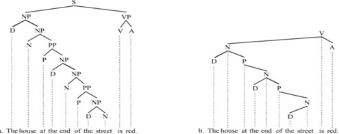
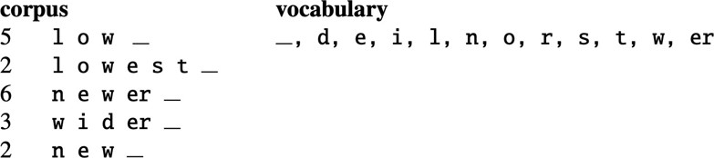

# Text Normalization

Text normalization is the process of converting a piece of text into a standardized or canonical form. This typically involves a combination of techniques such as case folding, stemming, lemmatization, and stop word removal, which are used to reduce the text to its core components and make it easier for natural language processing (NLP) algorithms to work with. The goal of text normalization is to make the text more consistent, uniform, and predictable, which can improve the accuracy and efficiency of NLP algorithms. Text normalization is an essential step in many NLP tasks, such as text classification, summarization, and translation, and can help to improve the performance of NLP systems by reducing the complexity and variability of the input.

## What the different types of Text Normalization?
There are several types of text normalization that are commonly used in natural language processing (NLP). Some of the main types of text normalization include:

Case folding: This involves converting all letters in the text to either upper or lower case, in order to make the text more uniform and easier to process.

Stemming: This involves reducing words to their core stems, typically by removing suffixes and other word endings, in order to normalize related words and improve the accuracy of algorithms.

Lemmatization: This involves reducing words to their base forms, called lemmas, in order to normalize related words and improve the accuracy of algorithms.

Stop word removal: This involves removing common words that do not contribute significant meaning to the text, such as "a", "an", and "the", in order to improve the efficiency and accuracy of algorithms.

Punctuation removal: This involves removing punctuation marks from the text, in order to make it easier for algorithms to process the text and improve the accuracy of their results.

Overall, these different types of text normalization can be used in combination to improve the performance of NLP algorithms and make it easier for them to accurately understand and generate natural language.

By Source:

- Text Normalization involves converting text to a standard form convenient for processing
- Text Normalization steps
    * Segmenting text into sentences
    * Segmenting sentences into words(tokenization)

## What is sentence segmentation,what are its challenges?
Sentence segmentation is the process of dividing a piece of text into individual sentences, in order to make it easier for natural language processing (NLP) algorithms to understand and generate language.Some of the main challenges of sentence segmentation include:

Complex sentence structure: Natural languages can have complex sentence structures, with multiple clauses, embedded phrases, and other elements that can make it difficult to determine where one sentence ends and another begins.

Ambiguity: Natural languages can be ambiguous, with words and phrases that can have multiple meanings or uses depending on the context. This can make it difficult to accurately determine the intended meaning of a sentence, and can affect the accuracy of sentence segmentation algorithms.

Variability: Natural languages can vary widely, with different dialects, accents, and styles that can affect the way sentences are formed and punctuated. This can make it difficult to develop a single algorithm that can accurately segment sentences in all languages and contexts.

Irregularities: Natural languages can have irregularities, such as abbreviations, contractions, and slang, that can make it difficult to accurately segment sentences using traditional rules and algorithms. This can require the use of more complex or flexible algorithms that can handle these irregularities.

Overall, sentence segmentation is a challenging task that requires careful consideration of the complexities and variability of natural language.

By Source:
- Challenging to disambiguate end of sentence vs. abbreviation
- Approach
    * Determine what periods are parts of words, e.g., based on rules, dictionary lookup, or using machine learning
- Assume remaining periods are ends of sentences
- Note that sometimes a period has a dual role, e.g., an abbreviation can be at the end of a sentence
- Your word and sentence tokenizers need to be coordinated

## What are the different WORD TOKENIZATION ALGORITHMS?

There are several different algorithms that can be used for word tokenization, which is the process of dividing a piece of text into individual words or tokens. Some of the main algorithms for word tokenization include:

Regular expressions: This algorithm uses a set of rules or patterns to identify words in a text, and can be effective at identifying words in many different languages.

Dictionary-based: This algorithm uses a pre-defined dictionary of words to identify and tokenize words in the text. This can be useful for handling rare or unusual words, but may not be effective for handling words that are not in the dictionary.

Statistical: This algorithm uses statistical models and machine learning techniques to identify words in the text, and can be effective at handling a wide range of languages and variations.

Hybrid: This algorithm combines multiple techniques, such as regular expressions and dictionary-based methods, in order to improve the accuracy and robustness of the tokenization process.

Overall, different algorithms may be more or less effective depending on the specific language, text, and NLP task at hand, and it may be necessary to experiment with different algorithms in order to find the best solution for a given problem.

By Source:

- Regular Expression-based approaches
- Penn Treebank tokenization
- Subword tokenization example: Byte Pair Encoding(BPE)

## Penn Tree Bank Tokenization

A commonly used standard

- Keeps hyphenated words as 1 token
- Keeps punctuation as separate tokens
Used for many baseline dataset tokenizations distributed by the Linguistic Data Consortium
A treebank is a text corpus where the sentence structure has been annotated (e.g., with parts of speech) 

## BYTE-PAIR ENCODING (BPE)

Byte-pair encoding (BPE) is a data compression algorithm that is commonly used in natural language processing (NLP) applications. BPE works by replacing frequently occurring pairs of bytes in the text with a single byte that represents the pair. This can help to reduce the size of the text, and can improve the performance of NLP algorithms by reducing the amount of data that needs to be processed. BPE is an example of a lossless compression algorithm, which means that the original text can be recovered from the compressed text without any loss of information. BPE is widely used in NLP applications such as machine translation, where it can help to reduce the amount of data that needs to be processed and improve the efficiency of the algorithms.

The steps for performing BPE are as follows:

Identify the most frequently occurring pairs of bytes in the text, and count how many times each pair occurs.

Replace each pair with a single byte that represents the pair. This byte is typically a combination of the two original bytes, but can be any other byte that is not already used in the text.

Repeat this process until no more pairs can be identified, or until a pre-defined threshold is reached. This can result in a compressed version of the original text, where each pair of bytes has been replaced with a single byte.

Decode the compressed text by reversing the steps above, replacing each byte with the original pair of bytes that it represents. This will result in the original text, without any loss of information.

Overall, BPE can be an effective way to reduce the size of a text and improve the performance of NLP algorithms by reducing the amount of data that needs to be processed.

By Source:

- BPE is an examples of a tokenization approach that results in “subwords”
    * Token learner part of the encoder computes a vocabulary of subwords for a particular corpus
    * Token segmenter uses the vocabulary to convert the text into tokens
- BPE steps
    * Start with a (token) vocabulary composed of the individual characters in the dataset
    * Choose the two symbols that are adjacent most frequently in the dataset (e.g., E & R), and add a new symbol corresponding to the merged two symbols, e.g., “ER” is added to the vocabulary as a new token
    * Repeat the merge procedure above for k steps (k is used to control the amount of computation that takes place) 
    
    * Unknown words can be represented with tokens - in the worst case by character-level tokens
    * If k is large enough, all words in the original text will be represented in the vocabulary as whole words (in addition to their various parts being represented).
